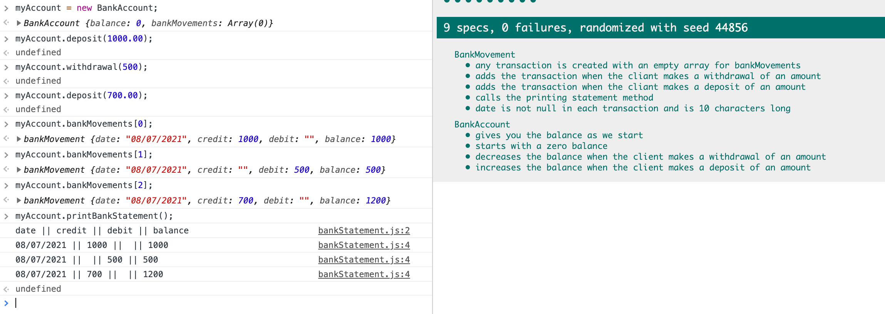

# Bank tech test

### Requirements

* You should be able to interact with your code via a REPL like IRB or the JavaScript console.  (You don't need to implement a command line interface that takes input from STDIN.)
* Deposits, withdrawal.
* Account statement (date, amount, balance) printing.
* Data can be kept in memory (it doesn't need to be stored to a database or anything).

### Acceptance criteria

**Given** a client makes a deposit of 1000 on 10-01-2012  
**And** a deposit of 2000 on 13-01-2012  
**And** a withdrawal of 500 on 14-01-2012  
**When** she prints her bank statement  
**Then** she would see

```
date || credit || debit || balance
14/01/2012 || || 500.00 || 2500.00
13/01/2012 || 2000.00 || || 3000.00
10/01/2012 || 1000.00 || || 1000.00
```

## Self-assessment

Once you have completed the challenge and feel happy with your solution, here's a form to help you reflect on the quality of your code: https://docs.google.com/forms/d/1Q-NnqVObbGLDHxlvbUfeAC7yBCf3eCjTmz6GOqC9Aeo/edit

## Prerequisites
````
git clone https://github.com/mvgame74/Bank-tech-test
````
## Running tests

````
open SpecRunner.html
````

## Usage
Using Chrome on a Mac, hold down Cmd + Alt + J to open the console.

Follow these instructions to run the program:

1. Run the program and create a bank account:
````
> myAccount = new BankAccount;
<= BankAccount {balance: 0, bankMovement: Array(0)}
````
2. Deposit £1000
````
> myAccount.deposit(1000);
<= undefined
> myAccount.balance;
<= 1000
````
3. Withdraw £5
````
> myAccount.withdraw(500);
<= undefined
> myAccount.balance;
<= 500
````
4. Display the balance
````
> myAccount.balance;
<= 500
````
5. Print a statement
````
> date || credit || debit || balance
06/07/2021 || 1000 ||  || 1000
06/07/2021 ||  || 500 || 500
<= undefined
````




## User stories
```
As a client,
So I can save money,
I need to open a bank account.

As a client,
So I can check how much money I have saved,
I need to have a bank balance.

As a client,
So I can have money in the bank account,
I  need to deposit money into it.

As a client,
So I can spend money,
I need to make withdrawals from my bank account.

As a client,
So I can check what my bank has recorded my movements correctlt,
I need to see a printed bank statement.

```
## Aproach

I stated by writing the simplest test I could think of:

1. create a bank account with zero balance
2. adding up to make deposits and make withdrawals
3. started building up the bank movements, by creating the line with each action (deposit or withdrawal) and pushing it into an array
4. progressed to be able to add a date to it, and modify the movement format
5. construccted the format for an output in console.log to be able to see all the movements together in a statement

## Structure

The structureis divided in three main files:

**bank.js** contains the initialisation of the bank account, and the methods for deposits, withdrawals and printing bank statements. 
**bankSpec.js** contains the testing for the contrauction of the application.
**date** contains the function for the creation of the date when a movements were made in the right format.